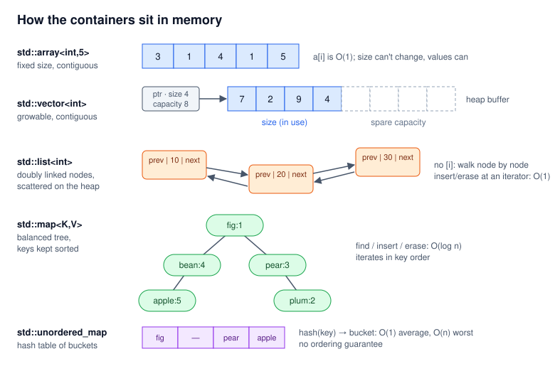
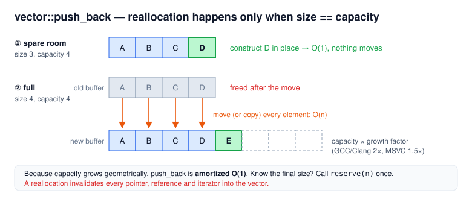
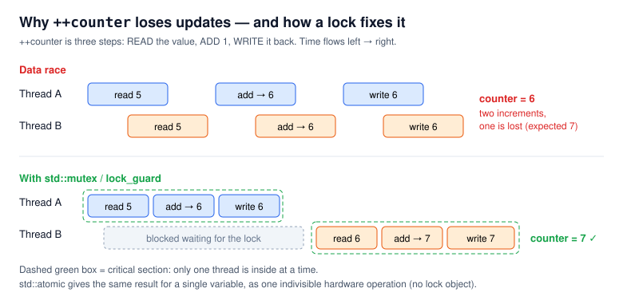
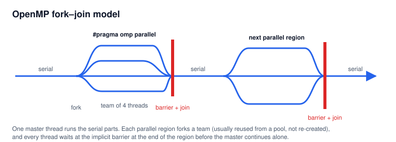
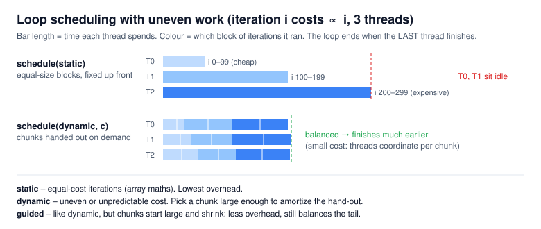
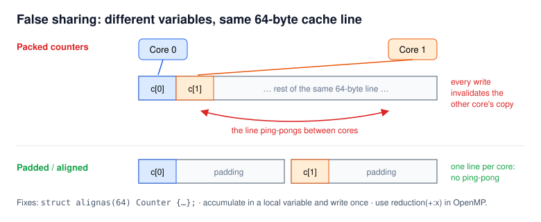

# C++ Etiquette Cheat Sheet

A quick reference for writing **correct, readable, modern C++**. Each section gives you the rule, the reason
for it, and a short snippet. Every topic has a runnable program in [`etiquette/demos/`](etiquette/demos)
so you can see the behavior for yourself.

```bash
# Build every demo at once (from the repo root)
cmake -S etiquette/demos -B build/etiquette
cmake --build build/etiquette -j
```

> **Legend:** **Do** = recommended habit · **Avoid** = common mistake · *C++17/20* = minimum standard needed.
> The demos use **C++20**, and the top-level `CMakeLists.txt` targets **C++23**.

---

## Contents

| Part | Topics | Demo |
|---|---|---|
| **1. Project layout** | [Headers & source files](#11-headers-and-source-files) · [CMake](#12-cmake) | `03_class/` |
| **2. Data & algorithms** | [Containers](#21-containers) · [Algorithms](#22-algorithms) · [Lambdas](#23-lambdas) · [Range-based for](#24-range-based-for) · [Dynamic programming](#25-dynamic-programming) | `01`, `02`, `05`, `06` |
| **3. Classes & resources** | [Class vs struct](#31-class-vs-struct) · [Class etiquette](#32-class-etiquette) · [RAII](#33-raii-and-the-rule-of-035) · [Smart pointers](#34-smart-pointers) · [Inheritance & polymorphism](#35-inheritance-and-polymorphism) | `03`, `04`, `05` |
| **4. Concurrency (`<thread>`)** | [Threads](#41-threads) · [Data races](#42-data-races-mutex-and-atomic) · [Condition variables](#43-condition-variables) · [Deadlock](#44-avoiding-deadlock) · [async / future](#45-async-and-future) · [Which tool?](#46-which-tool) | `07`, `08`, `09` |
| **5. OpenMP** | [Model & compiling](#51-the-fork-join-model-and-compiling) · [parallel for](#52-parallel-for-and-combining-results) · [Data-sharing](#53-data-sharing-clauses) · [Scheduling](#54-loop-scheduling) · [collapse](#55-nested-loops-collapse) · [False sharing](#56-performance-trap-false-sharing) · [sections & tasks](#57-task-parallelism-sections-and-task) · [Granularity](#58-granularity-and-amdahls-law) · [Which construct?](#59-which-construct) | `10`, `11` |

---

# Part 1 — Project layout

## 1.1 Headers and source files

| File | Holds | Who sees it |
|---|---|---|
| **Header** `.h` / `.hpp` | **Declarations**: the class definition, function *signatures*, templates, small inline functions | Every `.cpp` that `#include`s it, so it gets compiled many times |
| **Source** `.cpp` | **Definitions**: function bodies written as `ClassName::function` | Compiled **once** as its own *translation unit*, then linked |

**Include guards** stop a header being pasted twice into the same translation unit:

```cpp
#pragma once              // short; not in the ISO standard, but GCC, Clang and MSVC all support it

// or the classic, fully portable form:
#ifndef MYPROJECT_VECTOR2D_H
#define MYPROJECT_VECTOR2D_H
// ...
#endif
```

- **Do** give every header a guard, and include what you use. Each header should compile on its own.
- **Avoid** `using namespace std;` in headers, because it leaks into every file that includes them.
- **Avoid** defining non-`inline` functions or globals in a header. That causes "multiple definition" link errors.

See [`demos/03_class/`](etiquette/demos/03_class): `Vector2D.h` (declaration), `Vector2D.cpp` (definitions), `main.cpp` (user).

## 1.2 CMake

CMake does not build anything itself. It **generates** a build system (Makefiles, Ninja, or a Visual Studio
solution on Windows), and then that build system compiles your code.

```bash
cmake -S . -B build          # configure: source dir = ., build dir = build  (or: mkdir build; cd build; cmake ..)
cmake --build build -j       # compile in parallel (works with any generator)
cmake --build build --config Release   # multi-config generators (Visual Studio) pick the config here
```

A larger project has one **top-level** `CMakeLists.txt` with the shared settings. It pulls in one
`CMakeLists.txt` per sub-folder with `add_subdirectory()`:

```cmake
# top-level CMakeLists.txt
cmake_minimum_required(VERSION 3.16)
project(cpp_bootcamp LANGUAGES CXX)
set(CMAKE_CXX_STANDARD 20)
set(CMAKE_CXX_STANDARD_REQUIRED ON)
add_subdirectory(geometry)            # geometry/CMakeLists.txt defines its own targets

# geometry/CMakeLists.txt
add_library(geometry Vector2D.cpp)
target_include_directories(geometry PUBLIC ${CMAKE_CURRENT_SOURCE_DIR})
```

- **Do** keep builds *out of source* (a `build/` folder, already in `.gitignore`).
- **Do** use `target_*` commands (`target_link_libraries`, `target_include_directories`) rather than global ones.

See [`demos/CMakeLists.txt`](etiquette/demos/CMakeLists.txt). It also shows linking `Threads::Threads` and `OpenMP::OpenMP_CXX`.

---

# Part 2 — Data & algorithms

## 2.1 Containers



| Container | What it is | Access by index | Insert / erase | Notes |
|---|---|---|---|---|
| `T arr[N]` / **`std::array<T,N>`** | Fixed-size, contiguous | O(1) | n/a, the size is fixed | Size is fixed at compile time. **The elements can still be changed.** Prefer `std::array`: it knows its `size()` and does not decay to a pointer. |
| **`std::vector<T>`** | Growable, contiguous | O(1) | End: **amortized O(1)**. Middle: O(n) | **The default choice.** Cache-friendly. |
| **`std::list<T>`** | Doubly linked list | None, you walk node by node: O(n) | O(1) *once you have an iterator* | Use it only when you need stable iterators or splicing. It is often slower than `vector` in practice. |
| **`std::map<K,V>`** | Balanced binary tree, **sorted by key** | Lookup by key: O(log n) | O(log n) | Iterates in key order |
| **`std::unordered_map<K,V>`** | Hash table | Lookup by key: O(1) average | O(1) average | No ordering; the worst case is O(n) |
| **`std::string`** | A growable, owning `char` sequence | O(1) | Like `vector` | No manual buffers, no `strcpy` |

**How `vector` actually grows.** It does *not* copy itself on every `push_back`. It keeps spare **capacity**.
It reallocates only when `size() == capacity()`. When that happens it allocates a bigger buffer (about 1.5× to 2×),
moves the elements across, and frees the old buffer.



- **Do** call `v.reserve(n)` when you know the final size.
- **Do** remember that reallocation **invalidates** every pointer, reference and iterator into the vector.
- **Avoid** `m[key]` just to *look something up* in a map. `operator[]` **inserts** a default value when the key is missing. Use `find()`, or `contains()` in *C++20*.

Demo: [`01_containers.cpp`](etiquette/demos/01_containers.cpp). It prints the capacity each time it grows.

## 2.2 Algorithms

Prefer a named algorithm over a hand-written loop. The name says what the code is doing.

| Header | Function | What it does |
|---|---|---|
| `<algorithm>` | `std::sort(v.begin(), v.end())` | Sort ascending (or pass a comparator) |
| `<algorithm>` | `std::find_if(b, e, pred)` | Return an iterator to the **first** element where `pred` is true, or `e` if none |
| `<algorithm>` | `std::count_if`, `std::any_of`, `std::transform`, `std::for_each` | Count, test, map, visit |
| `<numeric>` | `std::accumulate(b, e, init)` | Fold with `+` (or any operator). **The type of `init` is the type of the result.** |

```cpp
std::sort(data.begin(), data.end());
auto it = std::find_if(data.begin(), data.end(), [](int v) { return v >= 7; });
if (it != data.end()) { /* found *it */ }            // always check before dereferencing

int    sum  = std::accumulate(data.begin(), data.end(), 0);
double mean = std::accumulate(data.begin(), data.end(), 0.0) / data.size();  // 0.0, not 0!
```

## 2.3 Lambdas

A lambda is an unnamed function object: `[captures](params) -> ret { body }`.

| Capture | Meaning |
|---|---|
| `[]` | Captures nothing. It only sees its parameters (and globals/statics). |
| `[x]` | Takes a **copy** of `x` when the lambda is created. The copy is read-only unless the lambda is `mutable`. |
| `[&x]` | Refers to the **original** `x`, so the lambda can modify it. |
| `[=]` | Copies every local the body uses. |
| `[&]` | References every local the body uses. |
| `[=, &x]` | Copies everything, except `x`, which is taken by reference. |
| `[this]` / `[*this]` | Captures the current object (by pointer / by copy, *C++17*) |

- **Do** list captures explicitly in anything longer than a one-liner.
- **Avoid** capturing locals by reference (`[&]`) in a lambda that **outlives the scope**, such as one stored or handed to a thread. The references dangle.

Demo: [`02_algorithms_lambdas.cpp`](etiquette/demos/02_algorithms_lambdas.cpp)

## 2.4 Range-based for

```cpp
for (auto x : v)        { }   // COPY of each element: changes are thrown away
for (auto& x : v)       { }   // REFERENCE: modify the elements in place
for (const auto& x : v) { }   // CONST REFERENCE: read-only, no copy. The default for reading
```

| You want to... | Write |
|---|---|
| Read cheap types (`int`, `double`) | `auto x` or `const auto& x` |
| Read large or non-copyable types (`std::string`, `std::unique_ptr`) | `const auto& x` |
| Modify the elements | `auto& x` |

> `for (auto p : vectorOfUniquePtrs)` doesn't even compile, because a `unique_ptr` can't be copied.

Demo: [`05_polymorphism_range_for.cpp`](etiquette/demos/05_polymorphism_range_for.cpp)

## 2.5 Dynamic programming

If a recursive solution solves the same subproblem over and over, store each answer once.

| | Top-down **memoization** | Bottom-up **tabulation** |
|---|---|---|
| How | Keep the recursion and cache each answer the first time it is computed | Fill a table from the base cases upward with loops |
| Computes | Only the states **reachable** from the starting state | **Every** state in the table |
| Good when | Only a fraction of the state space is actually needed | Most states are needed; you want speed |
| Costs | Function-call overhead; deep recursion can overflow the stack | You must work out the fill order |
| Bonus | Easy to write from the recursive definition | You can often keep only the last row(s) and **shrink memory** (e.g. O(n) → O(1)) |

Demo: [`06_dynamic_programming.cpp`](etiquette/demos/06_dynamic_programming.cpp). It computes `fib(35)` four ways: naive ~30 ms, memoized/table ~0 ms.

---

# Part 3 — Classes & resources

## 3.1 Class vs struct

A **class** is a user-defined type that bundles **data** (member variables) with the **functions** that act on
that data (member functions, or *methods*). It also draws a line between its *interface* and its *implementation*:

| Access | Who can use it | Role |
|---|---|---|
| `public` | Everyone | The **interface** |
| `protected` | The class and its derived classes | An internal interface for subclasses |
| `private` | Only the class's own members (and `friend`s) | The **implementation** |

Keeping data `private` behind a small `public` interface is **encapsulation**. The class alone guards its
**invariants**, and you can change its internals without breaking the code that uses it.

> `struct` and `class` are the **same** mechanism. The only difference is the default access: `struct` members are `public`,
> `class` members are `private`. By convention, use `struct` for plain bundles of data and `class` when there is
> behavior and invariants to protect.

## 3.2 Class etiquette

```cpp
class Vector2D {
public:
    Vector2D() = default;
    Vector2D(double x, double y) : x_(x), y_(y) {}          // member initializer list

    double magnitude() const { return std::sqrt(x_*x_ + y_*y_); }   // const: doesn't modify *this
    double x() const { return x_; }                        // getter
    void   set_x(double x) { x_ = x; }                     // setter

    Vector2D operator+(const Vector2D& rhs) const { return {x_ + rhs.x_, y_ + rhs.y_}; }
    bool operator==(const Vector2D&) const = default;      // C++20: compiler writes ==

private:
    double x_ = 0.0;    // default member initializers: never left uninitialized
    double y_ = 0.0;
};
std::ostream& operator<<(std::ostream& os, const Vector2D& v);   // free function (stream is on the left)
```

| Rule | Why |
|---|---|
| **Use the member initializer list** `: x_(x), y_(y)` | Members are *initialized before the constructor body runs*. Assigning in the body means default-construct, then assign. That is wasted work, and it is **impossible** for `const` members, references, and types with no default constructor. Members are initialized **in declaration order**, not list order, so keep the two the same. |
| **Mark read-only member functions `const`** | It is the only way to call them on a `const` object or through a `const&`, and the compiler enforces the promise. Const-correctness is also what makes an object safe to *read* from several threads. |
| **Getters/setters only when needed** | A setter lets the class **validate** new values (clamp, reject). A struct of public fields is fine when there is no invariant. |
| **`explicit` on single-argument constructors** | Stops surprise implicit conversions (`Circle c = 2.0;`) |
| **Operator overloading** gives *your* type a natural syntax (`a + b`, `a == b`, `std::cout << a`) | Overload an operator only when its meaning is obvious. Adding vectors is obvious; "multiplying" two employees is not. `operator+=` should return `*this` by reference. |
| **Function overloading**: the same name with different parameter lists | `Pizza()`, `Pizza(std::string)`, `Pizza(std::string, std::string)` |

Demo: [`03_class/`](etiquette/demos/03_class). Try uncommenting `a.x_ = 5.0;` or `a.set_x(1.0);` to see the compiler reject them.

## 3.3 RAII and the Rule of 0/3/5

**RAII = *Resource Acquisition Is Initialization*.** Tie a resource's lifetime to an object's lifetime:
acquire the resource in the **constructor** and release it in the **destructor**.

A **destructor** `~ClassName()` runs automatically when the object dies: at the closing `}` of its scope,
when its owner is destroyed, or **while an exception unwinds the stack**. You never call it by hand. Cleanup is
therefore *automatic* and *deterministic*.

```cpp
{
    std::vector<int> v(1000);           // memory acquired
    std::ifstream file("data.txt");     // file opened
    std::lock_guard<std::mutex> lk(m);  // mutex locked
    mayThrow();
}                                       // ALL released here, in reverse order, even if mayThrow() threw
```

How many special member functions should you write?

| Rule | When | Write |
|---|---|---|
| **Rule of Zero** *(preferred)* | Your members already manage themselves (`vector`, `string`, `unique_ptr`) | **Nothing.** The compiler-generated versions are correct. |
| **Rule of Three** | Your class *manually* owns a resource (raw `new`, a file handle, ...) | Destructor + copy constructor + copy assignment |
| **Rule of Five** | Same as above, and you also want cheap moves | The three above + move constructor + move assignment (mark the moves `noexcept`) |

> If you write *any* of the five, think about all five. Otherwise the compiler-generated copy will
> shallow-copy your raw pointer, and the program will free the same memory twice.

Demo: [`04_raii_smart_pointers.cpp`](etiquette/demos/04_raii_smart_pointers.cpp). It prints acquire/release on both the normal path and the exception path.
Further reading: [Rule of Three](https://www.geeksforgeeks.org/cpp/rule-of-three-in-cpp/) · [Rule of Five](https://www.geeksforgeeks.org/cpp/rule-of-five-in-cpp/) · [cppreference: rule of three/five/zero](https://en.cppreference.com/w/cpp/language/rule_of_three)

## 3.4 Smart pointers

Smart pointers apply RAII to heap memory. A smart pointer **owns** the object it points to and deletes it automatically.

| Type | Ownership | Copyable? | Create with |
|---|---|---|---|
| **`std::unique_ptr<T>`** | **Sole** owner. The object is deleted when the `unique_ptr` is destroyed. | No, **move-only** (`std::move` transfers ownership) | `std::make_unique<T>(args...)` |
| **`std::shared_ptr<T>`** | Shared. The object is deleted when the **last** owner goes away (reference count). | Yes | `std::make_shared<T>(args...)` |
| **`std::weak_ptr<T>`** | Non-owning observer of a `shared_ptr`; it breaks reference cycles | Yes | From a `shared_ptr` |

- **Do** default to `unique_ptr`. Reach for `shared_ptr` only when ownership is really shared.
- **Do** use `make_unique` / `make_shared` rather than naked `new`. They are exception-safe, shorter, and never leave an owner-less pointer.
- **Do** pass plain `T&` or `T*` to functions that only *use* an object. Pass a smart pointer only when the function takes part in ownership.

## 3.5 Inheritance and polymorphism

```cpp
class Shape {                                   // abstract base class
public:
    virtual ~Shape() = default;                 // REQUIRED when deleting through a Shape*
    virtual double area() const = 0;            // pure virtual: no body, every subclass must override
    virtual std::string name() const { return "Shape"; }   // virtual with a default body
};

class Circle : public Shape {                   // "a Circle is a Shape"
public:
    explicit Circle(double r) : r_(r) {}
    double area() const override { return std::numbers::pi * r_ * r_; }
    std::string name() const override { return "Circle"; }
private:
    double r_;
};

std::vector<std::unique_ptr<Shape>> shapes;
shapes.push_back(std::make_unique<Circle>(2.0));
for (const auto& s : shapes) std::cout << s->name() << ' ' << s->area() << '\n';  // picks Circle::area at run time
```

| Keyword | What it really means |
|---|---|
| `virtual` | Enables **dynamic dispatch**: a call through a base pointer or reference runs the *derived* class's version, chosen at run time. A virtual function **can** have a body. |
| `= 0` | **Pure virtual**: no implementation in the base. The class becomes **abstract**, so it cannot be instantiated, and derived classes must override the function. |
| `override` | Asks the compiler to **check** that this function really overrides a base virtual. A typo or a missing `const` becomes a compile error, instead of quietly creating a new, unrelated function. It does not save memory or change the generated code. |
| `final` | No further overriding (or no further deriving, if it's on a class) |

- **Do** give every polymorphic base a `virtual` (or `protected`) destructor.
- **Avoid** storing derived objects *by value* in a `std::vector<Shape>`. They get **sliced** down to `Shape`. Store `unique_ptr<Shape>` instead.

Demo: [`05_polymorphism_range_for.cpp`](etiquette/demos/05_polymorphism_range_for.cpp)

---

# Part 4 — Concurrency with `<thread>`

## 4.1 Threads

```cpp
std::vector<std::thread> pool;
for (int i = 0; i < 4; ++i)
    pool.emplace_back(greet, i, "hello");   // constructs a thread that STARTS RUNNING greet(i, "hello") now
for (auto& t : pool) t.join();              // block until each one finishes
```

| Fact | Detail |
|---|---|
| `std::thread t(f, args...)` | Starts a new OS thread running `f(args...)` **immediately**. Arguments are **copied** into the thread; use `std::ref(x)` to pass a reference. |
| `t.join()` | The calling thread waits until `t` finishes |
| **Must join or detach** | If a `std::thread` is still *joinable* when its destructor runs, the program calls `std::terminate()`. A finished thread is still joinable until you `join()` it. |
| `std::jthread` *(C++20)* | Joins automatically in its destructor (RAII). **Prefer it** in this repo (we compile as C++20/23). |
| Cost | Creating a thread typically takes **tens of microseconds**. That is cheap once, but expensive per tiny task. Reuse threads (a thread pool, OpenMP) when the work items are small. |
| How many? | `std::thread::hardware_concurrency()` reports a hint for the number of hardware threads |

## 4.2 Data races: mutex and atomic

A **data race** happens when two threads access the same memory, at least one of them writes, and nothing
synchronizes them. It is **undefined behavior**, not "just a slightly wrong number".



```cpp
// Fix 1 — mutex: a critical section that only one thread may enter at a time
std::mutex m;
long guarded = 0;
auto work = [&] {
    for (int i = 0; i < N; ++i) {
        std::lock_guard<std::mutex> lock(m);   // locks here; unlocks at } (RAII, even on exceptions)
        ++guarded;
    }
};

// Fix 2 — atomic: one indivisible read-modify-write on a single variable
std::atomic<long> counter{0};
auto work2 = [&] { for (int i = 0; i < N; ++i) ++counter; };

// Best — don't share: accumulate locally, publish once per thread
auto work3 = [&] { long local = 0; for (int i = 0; i < N; ++i) ++local; counter += local; };
```

| Tool | Protects | How | Use for |
|---|---|---|---|
| `std::mutex` + `std::lock_guard` | Any block of code (several variables, a container) | Other threads **block** until the lock is free | Multi-step updates that must look atomic as a whole |
| `std::atomic<T>` | **One** variable | Indivisible hardware operations, usually lock-free. **Every** thread can access it at the same time; the individual operations just can't tear. | Counters, flags, simple statistics |

- **Avoid** calling `lock()` / `unlock()` by hand. Use a RAII guard (`lock_guard`, `unique_lock`, `scoped_lock`).
- **Avoid** `volatile` as a threading tool. It is **not** synchronization.
- Two separate atomic operations are **not** atomic *together* (`if (a == 0) a = 1;` can still race). Use a mutex or `compare_exchange`.

Demo: [`07_threads_mutex_atomic.cpp`](etiquette/demos/07_threads_mutex_atomic.cpp). It prints the racy count next to the mutex and atomic counts, with timings.

## 4.3 Condition variables

Use a condition variable when one thread must **sleep until another thread says something changed**, for
example in a producer/consumer queue.

```cpp
// consumer
std::unique_lock<std::mutex> lock(m);              // unique_lock, because wait() must unlock and relock
cv.wait(lock, [] { return !queue.empty() || done; });  // ALWAYS pass a predicate

// producer
{ std::lock_guard<std::mutex> lk(m); queue.push(job); }   // change shared state UNDER the mutex
cv.notify_one();                                          // then wake a waiter
```

`wait(lock, pred)` atomically releases the mutex and sleeps. When it wakes, it re-locks the mutex and re-checks `pred`.
The predicate protects you against **spurious wakeups** and against notifications that arrived before you started waiting.

## 4.4 Avoiding deadlock

A **deadlock** happens when thread A holds lock 1 and waits for lock 2, while thread B holds lock 2 and waits for lock 1. Neither thread can ever continue.

```cpp
void transfer(Account& from, Account& to, int amount) {
    std::scoped_lock lock(from.m, to.m);   // C++17: locks BOTH, using a deadlock-avoidance algorithm
    from.balance -= amount;
    to.balance   += amount;
}
```

- **Do** use `std::scoped_lock` whenever you need more than one mutex at once. It is safe even if two threads list the mutexes in opposite orders.
- **Do** keep critical sections short, and never call unknown code (callbacks, I/O) while holding a lock.

Demo: [`09_condition_variable_scoped_lock.cpp`](etiquette/demos/09_condition_variable_scoped_lock.cpp)

## 4.5 async and future

`std::async` runs a callable and hands back a **`std::future<T>`**, a placeholder for a value that will exist later.
You don't need a `vector<thread>`, a `join()` loop, or a shared results array.

```cpp
std::vector<std::future<double>> futures;
for (int t = 0; t < 4; ++t)
    futures.push_back(std::async(std::launch::async, partial, std::cref(v), lo(t), hi(t)));

double total = 0;
for (auto& f : futures) total += f.get();   // waits for each task AND collects its result
```

| Piece | Meaning |
|---|---|
| `std::async(policy, f, args...)` | Runs `f(args...)` and returns a `std::future` for its result |
| `std::launch::async` | Run the task on a new thread **right away** |
| `std::launch::deferred` | Run it lazily, *on the calling thread*, when `get()` is called |
| *(no policy)* | Either `async` or `deferred`: the implementation chooses, and **may never run it in parallel**. Say `std::launch::async` when you want concurrency. |
| `f.get()` | Blocks until the result is ready and returns it. **Re-throws** any exception the task threw. You can call it only once. |

**Pitfall:** the future returned by `std::async(std::launch::async, ...)` **blocks in its destructor** until the task
finishes. If you discard it (`std::async(...);` on its own line), the "async" call quietly becomes synchronous. Keep the futures.

Demo: [`08_async_future.cpp`](etiquette/demos/08_async_future.cpp)

## 4.6 Which tool?

| Situation | Reach for |
|---|---|
| Run a few independent jobs and collect their results | `std::async` + `std::future` |
| Long-lived worker threads | `std::jthread` (or `std::thread` + `join`) |
| Shared counter or flag | `std::atomic<T>` |
| Shared container, or a multi-variable invariant | `std::mutex` + `std::lock_guard` |
| Several mutexes at once | `std::scoped_lock` |
| "Wait until X happens" | `std::condition_variable` + `std::unique_lock` |
| Data-parallel loops | **OpenMP** (Part 5) |

---

# Part 5 — OpenMP

## 5.1 The fork-join model and compiling



- One **master thread** runs the serial code.
- Each `#pragma omp parallel` region **forks** a team of threads. The threads synchronize at an **implicit barrier** at the end of the region and then **join** back into the master.
- You add one line of pragma instead of creating, partitioning and joining threads by hand. The runtime reuses its threads between regions.

| Compiler | Flag |
|---|---|
| GCC / Clang | `-fopenmp` |
| MSVC | `/openmp` supports **OpenMP 2.0 only**: no `task`, no `collapse`. Use **`/openmp:llvm`** (VS 2019 16.10+) for those. |
| CMake | `find_package(OpenMP)` → `target_link_libraries(app PRIVATE OpenMP::OpenMP_CXX)` |

**Guard the API** so that the code still builds without OpenMP. The compiler defines `_OPENMP` only when OpenMP is
enabled, and it ignores unknown `#pragma omp` lines otherwise:

```cpp
#ifdef _OPENMP
  #include <omp.h>
#else
  inline int    omp_get_thread_num()  { return 0; }   // "team of one" stubs
  inline int    omp_get_max_threads() { return 1; }
  inline double omp_get_wtime()       { /* std::chrono::steady_clock */ }
#endif
```

The full version is in [`demos/omp_compat.h`](etiquette/demos/omp_compat.h).

## 5.2 Parallel for and combining results

`#pragma omp parallel for` splits a loop's iterations across the team. It runs the body exactly as written, **bugs
included**. If the body updates a shared variable, you get the same data race as in [4.2](#42-data-races-mutex-and-atomic).

```cpp
double sum = 0.0;
#pragma omp parallel for reduction(+ : sum)
for (long i = 0; i < n; ++i) sum += a[i];
```

| Clause | How it works | Speed | Use for |
|---|---|---|---|
| *(none)* | Every thread writes the shared `sum` | Fast and **wrong** | Never |
| **`reduction(op:var)`** | Each thread gets a private copy; the copies are combined once at the end | **Fastest** | **The default** for sums, products, min/max |
| `#pragma omp atomic` | One scalar update (`x += ...`, `++x`) done as a single hardware operation | Slow when every iteration hits it | Occasional scalar updates |
| `#pragma omp critical` | A general critical section: one thread at a time | **Slowest**: it serializes the loop body | Updates too complex for `atomic` or `reduction` (e.g. `push_back`) |

Demo: [`10_openmp_loops.cpp`](etiquette/demos/10_openmp_loops.cpp)

## 5.3 Data-sharing clauses

| Clause | Each thread gets... |
|---|---|
| `shared(x)` | The **same** single `x` (the default for variables declared outside the region). You must synchronize writes. |
| `private(x)` | Its own **uninitialized** `x` |
| `firstprivate(x)` | Its own `x`, **initialized** to the value it had before the region |
| `lastprivate(x)` | Its own `x`. After the loop, `x` holds the value from the *sequentially last* iteration. |
| `default(none)` | Nothing implicitly: **you must classify every variable**. This is the best way to catch an accidental share. |

Variables declared *inside* the region, and the loop index of a `parallel for`, are private automatically.

## 5.4 Loop scheduling

The `schedule` clause decides **which iterations each thread runs**. The right choice depends on whether the iterations cost the same.



| Schedule | How | Best for |
|---|---|---|
| `schedule(static)` | Equal contiguous blocks, assigned up front. **Almost no overhead.** *(The default is implementation-defined, usually static.)* | Every iteration costs the same: number crunching, array maths |
| `schedule(dynamic, chunk)` | Threads grab `chunk` iterations at a time, on demand | **Uneven** or unpredictable cost. Make `chunk` large enough to amortize the hand-out. |
| `schedule(guided)` | Like dynamic, but chunks start large and shrink | Uneven work with less overhead than dynamic |

In the demo, iteration `i` does O(i) work. With `static`, the thread that gets the last block does most of
the work while the others sit idle. `dynamic` balances the load.

## 5.5 Nested loops: collapse

```cpp
#pragma omp parallel for collapse(2)
for (int r = 0; r < 3; ++r)            // only 3 outer iterations: on 16 threads, 13 would idle
    for (int c = 0; c < 1000; ++c)
        grid[r][c] = f(r, c);          // collapse(2) → one shared space of 3000 iterations
```

Use `collapse(N)` when:

- the outer loop alone has **too few iterations** to keep every thread busy,
- the loops are **perfectly nested**, with nothing between the `for` lines, and
- the iterations are **independent**.

If the inner bound depends on the outer index (a triangular loop), many compilers can't collapse the nest. (OpenMP 5.0 allows
some of these cases.) Parallelize only the outer loop instead.

## 5.6 Performance trap: false sharing

CPUs move memory between cores in **cache lines**, typically **64 bytes**. When two threads on different cores keep writing to
*different* variables that sit on the **same** line, each write invalidates the other core's copy of the line. The line then
ping-pongs between the cores. The variables aren't logically shared, but the hardware behaves as if they were.



- **Do** accumulate into a **local** variable and write the shared result once (or use `reduction`).
- **Do** pad or align per-thread data: `struct alignas(64) Counter { long v; };` (or use `std::hardware_destructive_interference_size` from `<new>`, *C++17*).
- **Avoid** `results[omp_get_thread_num()] += ...` inside a hot loop.

## 5.7 Task parallelism: sections and task

**`sections`**: a *small, fixed* set of *different* jobs, written out ahead of time.

```cpp
#pragma omp parallel sections
{
    #pragma omp section
    load_config();
    #pragma omp section
    open_log_file();
    #pragma omp section
    warm_up_cache();
}   // implicit barrier: all three are done here
```

`sections` does **not** scale beyond the number of sections you write. Three sections keep at most three threads busy, however many cores you have.

**`task`**: units of work created **at run time** and placed in a queue. Any idle thread in the team picks them up.
Tasks can create more tasks, which makes them the tool for recursive, divide-and-conquer work.

```cpp
long fib(int n) {
    if (n < 25) return fib_serial(n);        // CUTOFF: small problems run serially
    long a, b;
    #pragma omp task shared(a)
    a = fib(n - 1);
    #pragma omp task shared(b)
    b = fib(n - 2);
    #pragma omp taskwait                     // wait for THIS call's two child tasks
    return a + b;
}

#pragma omp parallel      // 1. create the team
#pragma omp single        // 2. exactly ONE thread starts the recursion; the rest run the tasks it spawns
result = fib(40);
```

Demo: [`11_openmp_tasks.cpp`](etiquette/demos/11_openmp_tasks.cpp)

## 5.8 Granularity and Amdahl's law

**Parallelism is not free, and it is never better than linear.**

- **Granularity**: every task or chunk has overhead (creating it, scheduling it, synchronizing). If each piece of work is tiny, the overhead dominates. In the demo, spawning a task at *every* `fib` call was **hundreds of times slower than serial**. Adding a cutoff made it faster than serial.
- **Amdahl's law**: if only a fraction *p* of the runtime can run in parallel, then *N* threads give at most

  $$\text{speedup} \le \frac{1}{(1-p) + p/N}$$

  With *p* = 0.9, even infinitely many threads give at most **10×**.
- **The algorithm matters more.** Parallelism divides the runtime by at most *N*. It cannot fix a bad complexity class. An O(2ⁿ) algorithm on 16 cores still loses to an O(n) algorithm on one core (compare §2.5).

## 5.9 Which construct?

| Construct | Use it for | Scales with |
|---|---|---|
| **`parallel for`** | The *same* operation over many data elements (a countable loop) | The number of iterations |
| **`sections`** | A *small, fixed* set of *different* jobs, known in advance | The number of sections you write |
| **`task`** | *Recursive* or *irregular* work whose size is discovered at run time (trees, graphs) | The number of tasks created (use a cutoff) |

Most numerical kernels are `parallel for`. Reach for `sections` when you have a couple of distinct jobs to overlap,
and for `task` when the work is a tree, a graph traversal, or anything you can't write down as a single loop.
